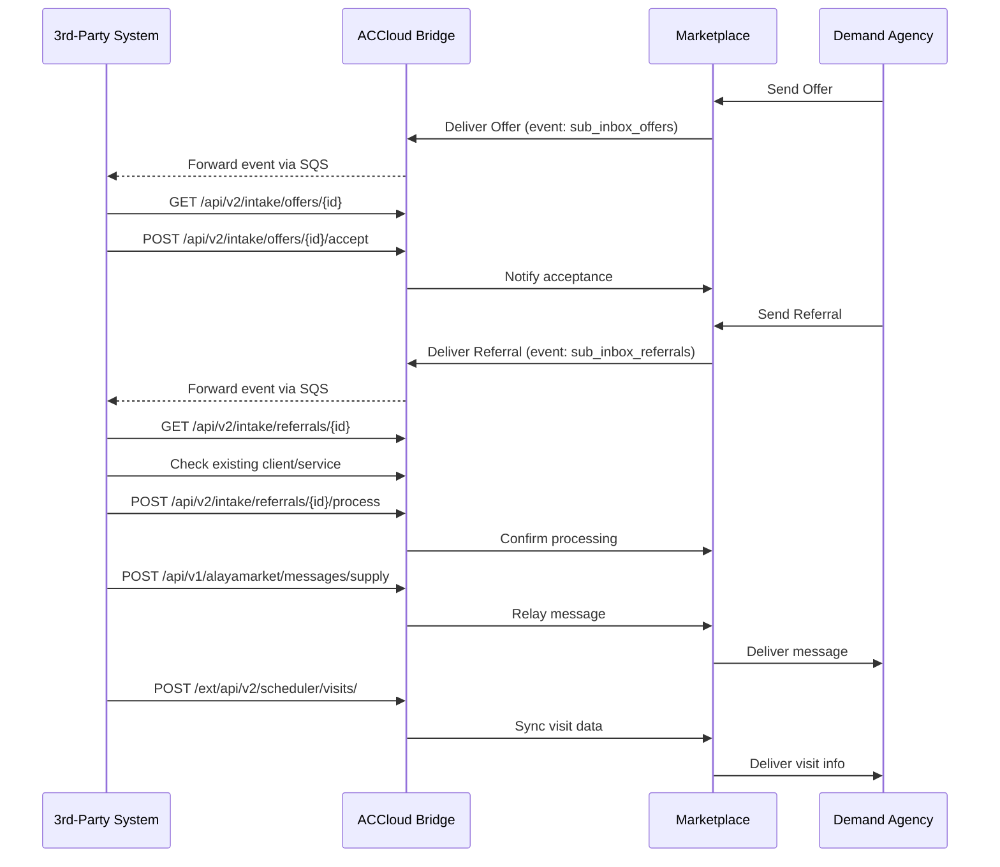

# AlayaCare Marketplace — 3rd-Party Integration Guide

> **Confidentiality:** This documentation is shared under your integration partner agreement with AlayaCare. Do not redistribute without authorization.

Technical documentation for 3rd-party suppliers integrating onto [AlayaCare Marketplace](https://alayacare.github.io/alayamarket-external-docs/) via an AlayaCare bridge instance.

## Architecture

3rd-party integrators are provisioned on a dedicated AlayaCare branch (e.g. `{partner}.uat.alayacare.com`) and interact with Marketplace exclusively through AlayaCare's external APIs and event system. The bridge architecture means:

- **100% AlayaCare stack** — no hybrid Marketplace/custom API surface to maintain
- **UI counterpart** — AlayaCare's web UI is available for progressive integration development and validation
- **Full monitoring** — all traffic flows through AlayaCare's observability stack
- **Platform upgrades** — integrators automatically benefit from AlayaCare platform improvements

## Getting Started

1. **[Environment Setup](docs/setup.md)** — Provisioning, authentication, API integration credentials, and event subscriptions
2. **[Error Handling](docs/error-handling.md)** — Status codes, error response formats, and retry strategies
3. Work through the integration workflows below

## Workflows

| # | Workflow | Description | Guide |
|---|----------|-------------|-------|
| 1 | **Offers** | Receive offers, fetch details, accept or decline | [docs/workflows/offers.md](docs/workflows/offers.md) |
| 2 | **Referrals** | Receive referrals, match to existing clients/services, process with multiple strategies | [docs/workflows/referrals.md](docs/workflows/referrals.md) |
| 3 | **Messages** | Send and receive messages, upload and retrieve file attachments | [docs/workflows/messages.md](docs/workflows/messages.md) |
| 4 | **Visits** | Create, update, and cancel scheduled visits | [docs/workflows/visits.md](docs/workflows/visits.md) |

## All Endpoints

| Method | Path | Source | Workflow |
|--------|------|--------|----------|
| `GET` | `/api/v2/intake/offers/alayamarket/by_external_offer_id/{id}/id` | Marketplace | [Offers](docs/workflows/offers.md) |
| `GET` | `/api/v2/intake/offers/{id}` | Marketplace | [Offers](docs/workflows/offers.md) |
| `POST` | `/api/v2/intake/offers/alayamarket/{id}/accept` | Marketplace | [Offers](docs/workflows/offers.md) |
| `POST` | `/api/v2/intake/offers/alayamarket/{id}/refuse` | Marketplace | [Offers](docs/workflows/offers.md) |
| `GET` | `/api/v2/intake/referrals/by_message_id/{id}/id` | Marketplace | [Referrals](docs/workflows/referrals.md) |
| `GET` | `/api/v2/intake/referrals/alayamarket/{id}` | Marketplace | [Referrals](docs/workflows/referrals.md) |
| `POST` | `/api/v2/intake/referrals/alayamarket/{id}/process` | Marketplace | [Referrals](docs/workflows/referrals.md) |
| `GET` | `/ext/api/v2/patients/clients` | [client-api-external](https://app.swaggerhub.com/apis/AlayaCare/client-api-external) | [Referrals](docs/workflows/referrals.md) |
| `GET` | `/ext/api/v2/patients/clients/{id}` | [client-api-external](https://app.swaggerhub.com/apis/AlayaCare/client-api-external) | [Referrals](docs/workflows/referrals.md) |
| `GET` | `/ext/api/v2/scheduler/services` | [services-api-external](https://app.swaggerhub.com/apis/AlayaCare/services-api-external) | [Referrals](docs/workflows/referrals.md) |
| `GET` | `/api/v1/alayamarket/messages/supply` | Marketplace | [Messages](docs/workflows/messages.md) |
| `POST` | `/api/v1/alayamarket/messages/supply` | Marketplace | [Messages](docs/workflows/messages.md) |
| `GET` | `/api/v1/alayamarket/messages/supply/files/{id}/preview` | Marketplace | [Messages](docs/workflows/messages.md) |
| `GET` | `/api/v1/alayamarket/inbox/sequences/by_service_id/{id}` | Marketplace | [Messages](docs/workflows/messages.md) |
| `POST` | `/ext/api/v2/files/client/{id}/{path}` | [files-api-external](https://app.swaggerhub.com/apis/AlayaCare/files-api-external) | [Messages](docs/workflows/messages.md) |
| `GET` | `/ext/api/v2/files/client/{id}/{path}` | [files-api-external](https://app.swaggerhub.com/apis/AlayaCare/files-api-external) | [Messages](docs/workflows/messages.md) |
| `POST` | `/ext/api/v2/scheduler/visits/` | [scheduler-api-external](https://app.swaggerhub.com/apis/AlayaCare/scheduler-api-external) | [Visits](docs/workflows/visits.md) |
| `PUT` | `/ext/api/v2/scheduler/visits/{id}` | [scheduler-api-external](https://app.swaggerhub.com/apis/AlayaCare/scheduler-api-external) | [Visits](docs/workflows/visits.md) |

## API References

> AsyncAPI and OpenAPI specs are synced periodically from the main Marketplace codebase. If you encounter discrepancies, contact your AlayaCare integration contact for the latest spec.

| API | Spec |
|-----|------|
| Client API | [SwaggerHub — client-api-external](https://app.swaggerhub.com/apis/AlayaCare/client-api-external) |
| Scheduler / Services API | [SwaggerHub — scheduler-api-external](https://app.swaggerhub.com/apis/AlayaCare/scheduler-api-external) |
| Services API | [SwaggerHub — services-api-external](https://app.swaggerhub.com/apis/AlayaCare/services-api-external) |
| Files API | [SwaggerHub — files-api-external](https://app.swaggerhub.com/apis/AlayaCare/files-api-external) |
| Marketplace Offers | [AlayaMarket OpenAPI — Offers](https://alayacare.github.io/alayamarket-external-docs/docs/offers/openapi.offers.html) |
| Marketplace Events | [AlayaMarket AsyncAPI — External Offers](https://alayacare.github.io/alayamarket-external-docs/docs/offers/asyncapi.external.offers/) |

## Related

- [AM-4531](https://alayacare.atlassian.net/browse/AM-4531) — Jira epic for 3rd-party partner support
- [ADM-2089](https://alayacare.atlassian.net/browse/ADM-2089) — Public documentation improvements
- [AlayaMarket External Docs](https://alayacare.github.io/alayamarket-external-docs/) — Full Marketplace API documentation
- [AlayaCare SwaggerHub](https://app.swaggerhub.com/search?owner=AlayaCare) — All AlayaCare external API specs
