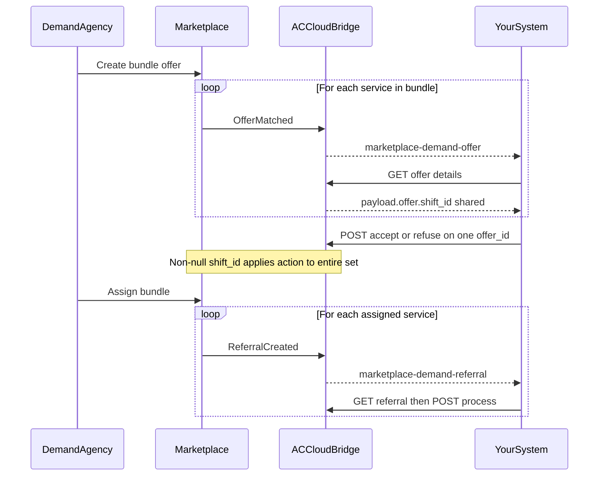

# Bundle Offers

A **bundle offer** is a set of Marketplace **service** offers that demand sends together. (By contrast, a *shift offer* groups visit offers.) In APIs and events they still appear as individual offers, but they share one grouping ID — `shift_id` (shown as **Bundle ID** in the AlayaCare UI).

Accepting or refusing **any one** offer in the set applies to **every** offer that shares that `shift_id`. After demand assigns the bundle, you receive **one referral per service** and process each referral independently.

This page extends the base [Offers](offers.md) and [Referrals](referrals.md) workflows. Endpoints are the same; only the grouping and cascade behavior differ.

## Prerequisites

- Complete the [Offers](offers.md) workflow first
- `marketplace-demand-offer` (and later `marketplace-demand-referral`) event subscriptions active (group: `marketplace`)

---

## How it differs from a single offer

| Topic | Single offer | Bundle offers |
|-------|--------------|---------------|
| Events | One `marketplace-demand-offer` event | One event **per** service in the bundle |
| Grouping field | `payload.offer.shift_id` is null / absent | Same non-null `payload.offer.shift_id` on every member |
| Accept / refuse | Acts on that offer only | Acting on **any** member accepts or refuses **all** members |
| After assignment | One referral | One referral **per** service (N referrals) |
| Process referral | One `process` call | One `process` call **per** referral — no bundle process API |

---

## Step 1: Receive Offer Events

Demand creates a bundle offer. Marketplace delivers a separate match for each service in the set.

Your SQS queue receives **N** `marketplace-demand-offer` events (typically `OfferMatched`), each with its own `offer_id`.

The event envelope identifies a **single** offer — it does **not** include `shift_id` or a bundle id. You discover grouping when you fetch offer details.

- **ACC event type (subscribe):** `marketplace-demand-offer`
- **AsyncAPI schema reference:** [inbox-offers](https://alayacare.github.io/alayamarket-external-docs/docs/offers/asyncapi.external.offers/#operation-send-sub_inbox_offers)

---

## Step 2: Fetch Offers and Detect the Bundle

Resolve and fetch each offer as in [Offers — Step 2](offers.md#step-2-fetch-the-offer).

On `GET $ACCLOUD_URL/api/v2/intake/offers/{offer_id}`, read:

```text
payload.offer.shift_id
```

- If `shift_id` is present, this offer is part of a bundle (or shift). Collect all pending offers that share that value before deciding.
- If `shift_id` is null or missing, treat the offer as standalone (see [Offers](offers.md)).

See [examples/payloads/offer_with_shift_id.json](../../examples/payloads/offer_with_shift_id.json) for a minimal illustration of the field path.

> **UI naming:** AlayaCare labels this value **Bundle ID** for bundle offers. In API responses the field name is always `shift_id`.

---

## Step 3: Accept or Refuse Once for the Whole Set

Use the same endpoints as a single offer:

* **Accept:** `POST $ACCLOUD_URL/api/v2/intake/offers/alayamarket/{offer_id}/accept`
* **Refuse:** `POST $ACCLOUD_URL/api/v2/intake/offers/alayamarket/{offer_id}/refuse` with a `reason` from [Offers — Step 3](offers.md#step-3-accept-or-decline-the-offer)

**Important:** Call accept or refuse on **one** offer in the set. Marketplace treats an offer with a non-null `shift_id` as a shift/bundle action and applies the same outcome to every offer that shares that `shift_id`.

Do **not** loop accept/refuse across every sibling offer id — that is unnecessary and can produce confusing duplicate side effects in your own system if you are not idempotent.

Lifecycle events (`OfferClosed`, `OfferExpired`, `OfferFulfilled`) still arrive **per offer**. Clean up each id, but expect siblings that share `shift_id` to move together when demand closes or fulfills the set.

---

## Step 4: After Assignment — Referrals

When demand **assigns** the accepted bundle (manually or via auto-assign):

1. Marketplace creates **one referral per service** in the bundle (N referrals for N services), not a single “bundle referral.”
2. Your queue receives **N** `marketplace-demand-referral` events (for example `ReferralCreated`), each with its own referral id.
3. Fetch and process **each** referral with the strategies in [Referrals](referrals.md). There is no “process entire bundle” endpoint.

### Correlating sibling referrals

Sibling referrals from the same assigned bundle share Marketplace’s referral `shift_id` (the same UUID as the offer-side bundle). On intake referral detail, that value is exposed as **`summary.alayamarket_shift_id`** (mapped from the Marketplace `referral.shift_id` field).

Use it to correlate related referrals; still run client/service matching and `POST .../process` **per referral**.

> Once assigned, referrals are maintained separately. Accept/refuse was all-or-nothing at the offer stage; processing is not.

---

## Sequence



---

**Related:** [Offers](offers.md) · [Referrals](referrals.md)

<!--
Maintainer sources (not for partners):
- alayamarket SupplyAdminOfferService.accept_offer / accept_shift_offer / decline_* (shift_id cascade)
- accloud-service-alayamarket inbox OfferService.on_acc_event_offer_accepted (_get_am_shift_id)
- accloud-intake-service AlayaMarketOfferAdapter (payload["offer"]["shift_id"]); SummarySchema attribute payload.offer.shift_id
- accloud-intake-service AM referral parser: alayamarket_shift_id attribute="referral.shift_id"
- openapi.offers.yaml: bundle.id referred to as shift_id when retrieving offers
- e2e test_bundle_offers.py: accept/refuse/assign one member updates all
-->
