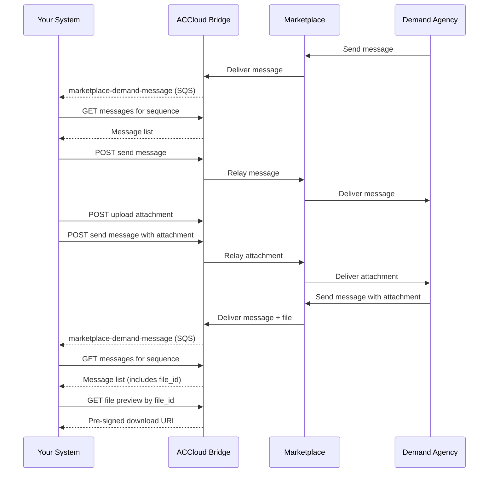

# Messages

Messages allow your organization to communicate with demand agencies through Marketplace. You can send and receive text messages and file attachments within the context of a referral sequence.

## Prerequisites

- [Environment setup](../setup.md) complete
- `marketplace-demand-message` event subscription active (group: `marketplace`)
- Review [Error Handling](../error-handling.md) for status codes and retry guidance

---

## Step 1: Receive Message Events

When a demand agency sends a message, your SQS queue receives a `marketplace-demand-message` event (subtype typically `marketplace-demand-message-sent`).

- **ACC event type (subscribe):** `marketplace-demand-message`
- **AsyncAPI schema reference:** [inbox-messages](https://alayacare.github.io/alayamarket-external-docs/docs/offers/asyncapi.external.offers/#operation-send-sub_inbox_messages)

See the [AsyncAPI spec](https://alayacare.github.io/alayamarket-external-docs/docs/offers/asyncapi.external.offers/#operation-send-sub_inbox_messages) for the full payload schema and examples.

---

## Step 2: Fetch Messages

Retrieve messages for a given referral sequence.

* **URL:** `GET $ACCLOUD_URL/api/v1/alayamarket/messages/supply`

* **Query parameters:**

| Parameter | Required | Description |
|-----------|----------|-------------|
| `branch_id` | Yes | Your branch ID (constant) |
| `alayamarket_sequence_id` | Yes | The sequence ID from the referral |
| `items_per_page` | No | Number of results per page (default: 10) |
| `page` | No | Page number (default: 1) |
| `sort_order` | No | `asc` or `desc` (default: `asc`). Pass `desc` explicitly for newest-first. |

* **Response:** Returns a paginated array of message objects.

**Pagination:** To retrieve all messages, loop through pages until `page * items_per_page >= total`. Increment `page` by 1 on each request.

* **Example:**

```
GET $ACCLOUD_URL/api/v1/alayamarket/messages/supply?branch_id={BRANCH_ID}&alayamarket_sequence_id={sequence_id}&items_per_page=10&page=1&sort_order=desc
```

---

## Step 3: Send a Message

Send a text message to the demand agency within a referral sequence.

* **URL:** `POST $ACCLOUD_URL/api/v1/alayamarket/messages/supply`

* **Content-Type:** `multipart/form-data`

* **Form fields:**

| Field | Required | Description |
|-------|----------|-------------|
| `branch_id` | Yes | Your branch ID (constant) |
| `alayamarket_sequence_id` | Yes | The sequence ID for the referral |
| `category` | Yes | `comment` |
| `sender_type` | Yes | `supply` |
| `text` | Yes | Message body (up to 5,000 characters) |
| `author` | Yes | Display name of the sender |

* **Example (curl):**

```bash
curl -X POST "$ACCLOUD_URL/api/v1/alayamarket/messages/supply" \
  -u "$API_KEY:$API_SECRET" \
  -F "branch_id={BRANCH_ID}" \
  -F "alayamarket_sequence_id={sequence_id}" \
  -F "category=comment" \
  -F "sender_type=supply" \
  -F "text=We have reviewed the referral and will begin care on Monday." \
  -F "author=Jane Doe"
```

* **Response:** Returns the created message ID.

```json
{
  "id": 102
}
```

See [examples/payloads/send_message.json](../../examples/payloads/send_message.json) for field reference.

> **Upcoming enforcement:** The API currently accepts empty `text` for `comment` messages, but server-side validation will be enforced in a future release. Always send a non-empty `text` value to avoid future breakage.

---

## Step 4: Upload a Client Attachment

Upload a file to the client's attachments in AlayaCare. The file is stored under the client's Marketplace Documents folder.

* **API reference:** [files-api-external](https://app.swaggerhub.com/apis/AlayaCare/files-api-external#/File/post_client__id___path_)

* **URL:** `POST $ACCLOUD_URL/ext/api/v2/files/client/{client_id}/{file_path}`

* **Content-Type:** `multipart/form-data`

* **Form fields:**

| Field | Required | Description |
|-------|----------|-------------|
| `file` | Yes | The file binary |

* **Example (curl):**

```bash
curl -X POST "$ACCLOUD_URL/ext/api/v2/files/client/{client_id}/marketplace-documents/care-plan.pdf" \
  -u "$API_KEY:$API_SECRET" \
  -F "file=@/path/to/care-plan.pdf"
```

* **Notes:**
  * The `client_id` in the URL path and the client ID embedded in the `file_path` must match — otherwise the file may appear under the wrong client
  * The file path is associated with a service ID. To find the correct path, look up the sequence by service ID (see below)

### Find the File Path via Sequence

* **URL:** `GET $ACCLOUD_URL/api/v1/alayamarket/inbox/sequences/by_service_id/{service_id}`

* **Response:** Returns sequence metadata including identifiers and file path structure.

```json
{
  "alayamarket_sequence_id": "seq-001",
  "client_id": 1060,
  "service_id": 21,
  "file_path": "marketplace-documents/"
}
```

* **Notes:**
  * Returns sequence metadata including the file path structure for the associated client and service

---

## Step 5: Send a Message with Attachment

Send a message that includes a file attachment within the referral sequence.

* **URL:** `POST $ACCLOUD_URL/api/v1/alayamarket/messages/supply`

* **Content-Type:** `multipart/form-data`

* **Form fields:**

| Field | Required | Description |
|-------|----------|-------------|
| `branch_id` | Yes | Your branch ID (constant) |
| `alayamarket_sequence_id` | Yes | The sequence ID for the referral |
| `category` | Yes | `client_attachment` |
| `sender_type` | Yes | `supply` |
| `text` | Yes | Message body (up to 5,000 characters) |
| `author` | Yes | Display name of the sender |
| `file` | Yes | The file binary |

* **Example (curl):**

```bash
curl -X POST "$ACCLOUD_URL/api/v1/alayamarket/messages/supply" \
  -u "$API_KEY:$API_SECRET" \
  -F "branch_id={BRANCH_ID}" \
  -F "alayamarket_sequence_id={sequence_id}" \
  -F "category=client_attachment" \
  -F "sender_type=supply" \
  -F "text=Attached is the signed care plan." \
  -F "author=Jane Doe" \
  -F "file=@/path/to/signed-care-plan.pdf"
```

* **Response:** Returns the created message ID.

```json
{
  "id": 103
}
```

See [examples/payloads/send_message_attachment.json](../../examples/payloads/send_message_attachment.json) for field reference.

> **Upcoming enforcement:** The API currently accepts missing `file` for `client_attachment` messages, but server-side validation will be enforced in a future release. Always include a `file` when `category` is `client_attachment`.

---

## Step 6: Retrieve an Attachment

### Option A: Retrieve a Client Attachment by Path

* **API reference:** [files-api-external — File](https://app.swaggerhub.com/apis/AlayaCare/files-api-external#/File)

* **URL:** `GET $ACCLOUD_URL/ext/api/v2/files/client/{client_id}/{file_path}`

* **Notes:**
  * Use the same path structure from Step 4
  * The file path can be discovered from the sequence endpoint (Step 4 note)

### Option B: Retrieve a Message Attachment by File ID

Use the file ID from a message (fetched in Step 2) to get a preview/download link.

* **URL:** `GET $ACCLOUD_URL/api/v1/alayamarket/messages/supply/files/{file_id}/preview?branch_id={BRANCH_ID}`

* **Response:** Returns a pre-signed URL for file download.

```json
{
  "url": "https://..."
}
```

---

## Sequence



---

**Next:** [Visits](visits.md) — Report visit scheduling and status to demand agencies
