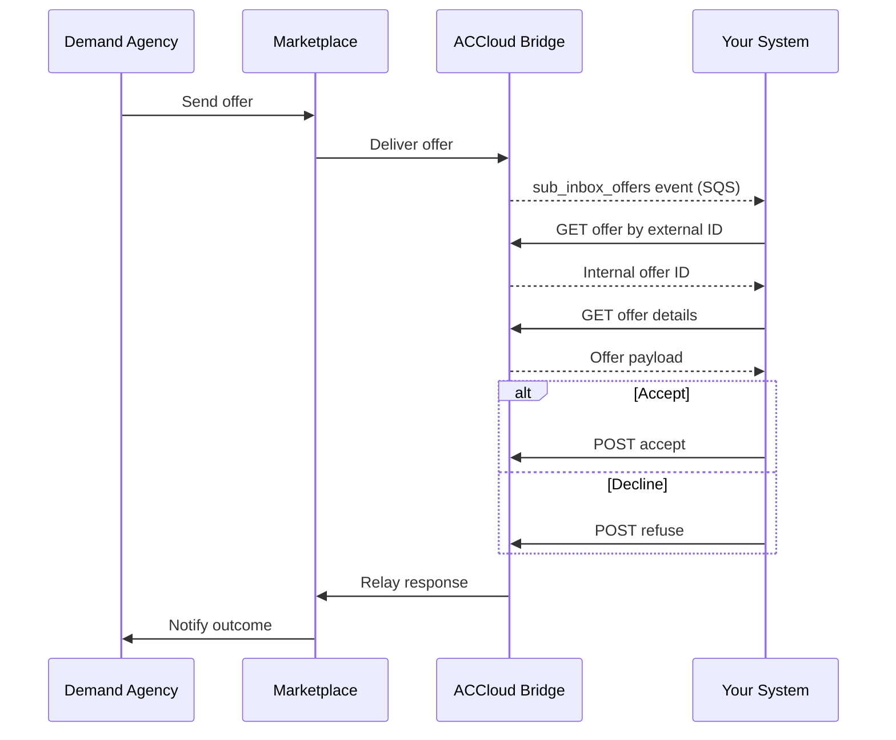

# Offers

Offers are sent by demand agencies through Marketplace to your supply organization. When an offer arrives, you receive a `sub_inbox_offers` event. Your integration should fetch the offer details and respond by accepting or declining.

## Prerequisites

- [Environment setup](../setup.md) complete
- `sub_inbox_offers` event subscription active
- Review [Error Handling](../error-handling.md) for status codes and retry guidance

---

## Step 1: Receive the Offer Event

When a demand agency sends an offer, your SQS queue receives a `sub_inbox_offers` event payload containing the offer identifier.

- **AsyncAPI reference:** [sub_inbox_offers](https://alayacare.github.io/alayamarket-external-docs/docs/offers/asyncapi.external.offers/#operation-send-sub_inbox_offers)

**Example SQS payload** (see the AsyncAPI spec for the full schema):

```json
{
  "event_type": "sub_inbox_offers",
  "offer_id": "abc-123",
  "timestamp": "2026-04-10T14:00:00Z"
}
```

---

## Step 2: Fetch the Offer

You can fetch the offer using either the external (Marketplace) offer ID or the internal AlayaCare offer ID.

### Option A: Resolve Internal ID from External Offer ID

* **URL:** `GET $ACCLOUD_URL/api/v2/intake/offers/alayamarket/by_external_offer_id/{offer_id}/id`

* **Response:** Returns the internal AlayaCare integer offer ID.

```json
{
  "id": 42
}
```

* **Notes:**
  * `{offer_id}` is the Marketplace offer ID from the event payload

### Option B: Fetch Offer Details by Internal ID

* **URL:** `GET $ACCLOUD_URL/api/v2/intake/offers/{offer_id}`

* **Response:** Returns the full offer object. Refer to the [AsyncAPI spec](https://alayacare.github.io/alayamarket-external-docs/docs/offers/asyncapi.external.offers/) for the canonical field list. Key fields include:

```json
{
  "id": 42,
  "external_offer_id": "abc-123",
  "status": "pending",
  "client": { "first_name": "...", "last_name": "...", "date_of_birth": "..." },
  "service": { "care_type": "...", "start_date": "...", "end_date": "..." },
  "demand_agency": { "name": "..." }
}
```

* **Notes:**
  * `{offer_id}` is the internal AlayaCare offer ID (from Option A or from the event payload if already resolved)

---

## Step 3: Accept or Decline the Offer

After reviewing the offer details, respond by accepting or declining.

### Accept

* **URL:** `POST $ACCLOUD_URL/api/v2/intake/offers/alayamarket/{offer_id}/accept`

* **Response:** Returns a status confirmation.

```json
{
  "status": "accepted"
}
```

* **Notes:**
  * No request body required
  * The offer status will change to accepted and the demand agency will be notified via Marketplace

### Decline

* **URL:** `POST $ACCLOUD_URL/api/v2/intake/offers/alayamarket/{offer_id}/refuse`

* **Example payload:**

```json
{
  "reason": "cancel"
}
```

* **Valid `reason` values:**

| Value | Meaning |
|-------|---------|
| `cancel` | General decline — no specific reason provided |
| `no_capacity` | Your organization does not have available capacity |
| `out_of_area` | The client's location is outside your service area |
| `service_not_offered` | The requested care type is not offered by your organization |

> If you're unsure which value to use, `cancel` is always accepted. The demand agency sees the reason you provide.

* **Response:** Returns a status confirmation.

```json
{
  "status": "refused"
}
```

* **Notes:**
  * A `reason` must be provided
  * The demand agency will be notified of the decline via Marketplace

---

## Step 4: Handle Offer Lifecycle Events

An offer may be withdrawn or resolved by the demand side before your integration acts on it. Listen for these events via `sub_inbox_offers` and handle them gracefully.

| Event | Meaning | Recommended Action |
|-------|---------|-------------------|
| `OfferClosed` | The demand agency withdrew the offer. | Remove the offer from your pending queue. Cancel any internal workflows initiated for this offer. |
| `OfferExpired` | The offer timed out without a response. | Clean up internal state. No further action possible on this offer. |
| `OfferFulfilled` | Another supply agency was assigned. | Remove the offer from your pending queue. Stop polling for this offer. |

> Always fetch the offer status before attempting to accept or decline. If the offer is in a terminal state (`closed`, `expired`, `fulfilled`), skip processing and log the outcome.

---

## Sequence



---

**Next:** [Referrals](referrals.md) — Receive and process referrals from demand agencies
