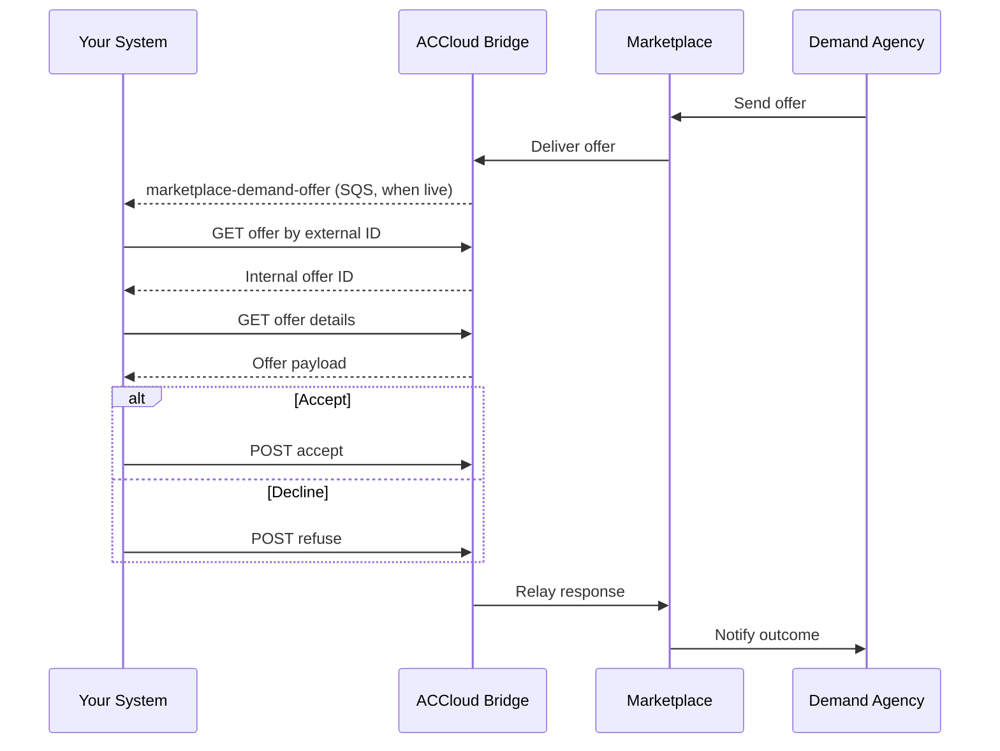

# Offers

Offers are sent by demand agencies through Marketplace to your supply organization. When ACC offer events are live, your SQS queue receives a `marketplace-demand-offer` event. Your integration should fetch the offer details and respond by accepting or declining.

> **ACC status:** `marketplace-demand-offer` is **not registered yet** in System Settings → External events → SQS queues. Use the Intake/Marketplace offer APIs below for accept/refuse today. Subscribe to `marketplace-demand-offer` (group: `marketplace`) when your AlayaCare contact confirms it is available. Until then, use the [AsyncAPI inbox-offers schema](https://alayacare.github.io/alayamarket-external-docs/docs/offers/asyncapi.external.offers/#operation-send-sub_inbox_offers) as the intended payload reference.

> **Bundle offers:** If `payload.offer.shift_id` is present on the offer details, the offer is part of a multi-service bundle. Accepting or refusing one member applies to the whole set, and assignment yields one referral per service. See [Bundle Offers](bundle-offers.md).

## Prerequisites

- [Environment setup](../setup.md) complete
- `marketplace-demand-offer` event subscription active when available (see note above)
- Review [Error Handling](../error-handling.md) for status codes and retry guidance

---

## Step 1: Receive the Offer Event

When a demand agency sends an offer and ACC delivery is enabled, your SQS queue receives a `marketplace-demand-offer` event containing the offer identifier.

- **ACC event type (subscribe):** `marketplace-demand-offer` (not live yet)
- **AsyncAPI schema reference:** [inbox-offers](https://alayacare.github.io/alayamarket-external-docs/docs/offers/asyncapi.external.offers/#operation-send-sub_inbox_offers)

See the [AsyncAPI spec](https://alayacare.github.io/alayamarket-external-docs/docs/offers/asyncapi.external.offers/#operation-send-sub_inbox_offers) for the full payload schema and examples (`OfferMatched`, `OfferClosed`, and related `event_name` values).

---

## Step 2: Fetch the Offer

You can fetch the offer using either the external (Marketplace) offer ID or the internal AlayaCare offer ID.

### Option A: Resolve Internal ID from External Offer ID

* **URL:** `GET $ACCLOUD_URL/api/v2/intake/offers/alayamarket/by_external_offer_id/{offer_id}/id`

* **Response:** Returns the internal AlayaCare integer offer ID.

```json
{
  "id": 42
}
```

* **Notes:**
  * `{offer_id}` is the Marketplace offer ID from the event payload

### Option B: Fetch Offer Details by Internal ID

* **URL:** `GET $ACCLOUD_URL/api/v2/intake/offers/{offer_id}`

* **Response:** Returns the full offer object including client demographics, service details, and demand agency info. <!-- TODO: link to api.intake OpenAPI spec once published -->

* **Notes:**
  * `{offer_id}` is the internal AlayaCare offer ID (from Option A or from the event payload if already resolved)

---

## Step 3: Accept or Decline the Offer

After reviewing the offer details, respond by accepting or declining.

### Accept

* **URL:** `POST $ACCLOUD_URL/api/v2/intake/offers/alayamarket/{offer_id}/accept`

* **Response:** Returns a status confirmation.

```json
{
  "status": "accepted"
}
```

* **Notes:**
  * No request body required
  * The offer status will change to accepted and the demand agency will be notified via Marketplace

### Decline

* **URL:** `POST $ACCLOUD_URL/api/v2/intake/offers/alayamarket/{offer_id}/refuse`

* **Example payload:**

```json
{
  "reason": "cancel"
}
```

* **Valid `reason` values:**

| Value | Meaning |
|-------|---------|
| `cancel` | General decline — no specific reason provided |
| `no_capacity` | Your organization does not have available capacity |
| `out_of_area` | The client's location is outside your service area |
| `service_not_offered` | The requested care type is not offered by your organization |

> If you're unsure which value to use, `cancel` is always accepted. The demand agency sees the reason you provide.

* **Response:** Returns a status confirmation.

```json
{
  "status": "refused"
}
```

* **Notes:**
  * A `reason` must be provided
  * The demand agency will be notified of the decline via Marketplace

---

## Step 4: Handle Offer Lifecycle Events

An offer may be withdrawn or resolved by the demand side before your integration acts on it. When ACC offer events are live, listen via `marketplace-demand-offer`, remove the offer from your pending queue, and handle lifecycle `event_name` values gracefully.

| Event | Meaning | Recommended Action |
|-------|---------|-------------------|
| `OfferClosed` | The demand agency withdrew the offer. | Cancel any internal workflows initiated for this offer. |
| `OfferExpired` | The offer timed out without a response. | Clean up internal state. No further action possible on this offer. |
| `OfferFulfilled` | Another supply agency was assigned. | Stop polling for this offer. |

> Always fetch the offer status before attempting to accept or decline. If the offer is in a terminal state (`closed`, `expired`, `fulfilled`), skip processing and log the outcome.

---

## Sequence



---

**Next:** [Bundle Offers](bundle-offers.md) (when `shift_id` is present) · [Referrals](referrals.md)
