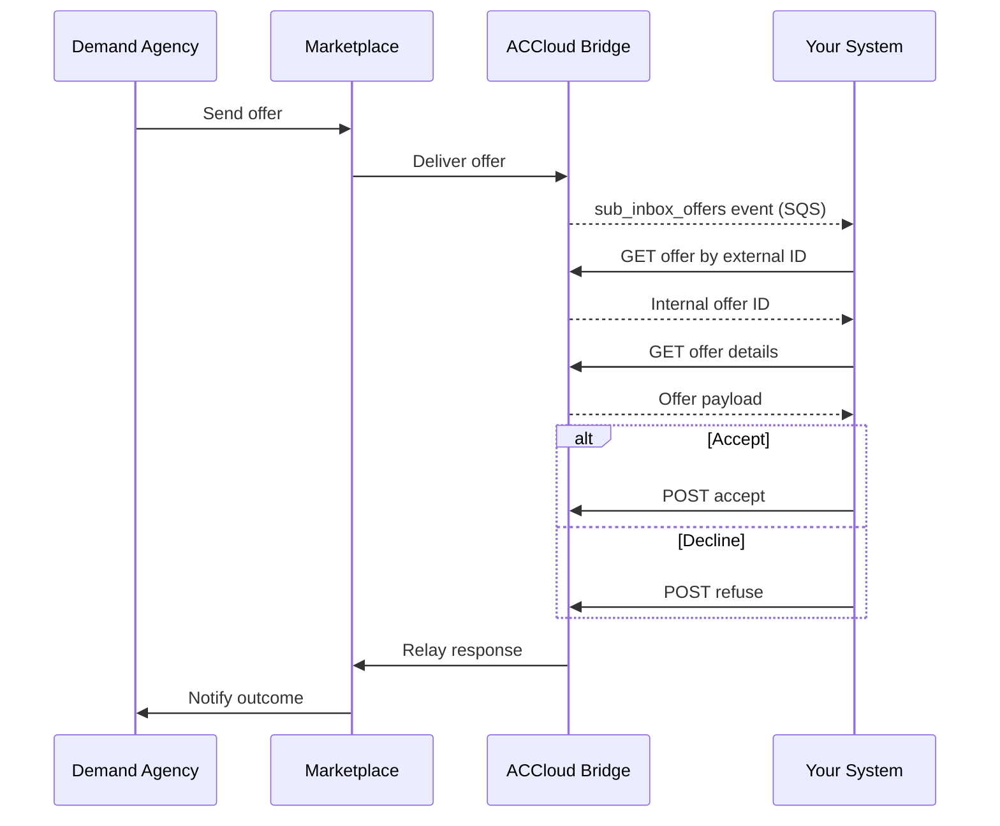

# Offers

Offers are sent by demand agencies through Marketplace to your supply organization. When an offer arrives, you receive a `sub_inbox_offers` event. Your integration should fetch the offer details and respond by accepting or declining.

## Prerequisites

- [Environment setup](../setup.md) complete
- `sub_inbox_offers` event subscription active

---

## Step 1: Receive the Offer Event

When a demand agency sends an offer, your SQS queue receives a `sub_inbox_offers` event payload containing the offer identifier.

- **AsyncAPI reference:** [sub_inbox_offers](https://alayacare.github.io/alayamarket-external-docs/docs/offers/asyncapi.external.offers/#operation-send-sub_inbox_offers)

---

## Step 2: Fetch the Offer

You can fetch the offer using either the external (Marketplace) offer ID or the internal AlayaCare offer ID.

### Option A: Resolve Internal ID from External Offer ID

* **URL:** `GET $ACCLOUD_URL/api/v2/intake/offers/alayamarket/by_external_offer_id/{offer_id}/id`

* **Notes:**
  * `{offer_id}` is the Marketplace offer ID from the event payload
  * Returns the internal AlayaCare offer ID

### Option B: Fetch Offer Details by Internal ID

* **URL:** `GET $ACCLOUD_URL/api/v2/intake/offers/{offer_id}`

* **Notes:**
  * `{offer_id}` is the internal AlayaCare offer ID (from Option A or from the event payload if already resolved)
  * Returns the full offer details including client demographics, service info, and care type

---

## Step 3: Accept or Decline the Offer

After reviewing the offer details, respond by accepting or declining.

### Accept

* **URL:** `POST $ACCLOUD_URL/api/v2/intake/offers/alayamarket/{offer_id}/accept`

* **Notes:**
  * No request body required
  * The offer status will change to accepted and the demand agency will be notified via Marketplace

### Decline

* **URL:** `POST $ACCLOUD_URL/api/v2/intake/offers/alayamarket/{offer_id}/refuse`

* **Example payload:**

```json
{
  "reason": "cancel"
}
```

* **Notes:**
  * A `reason` must be provided
  * The demand agency will be notified of the decline via Marketplace

---

## Sequence



---

**Next:** [Referrals](referrals.md) — Receive and process referrals from demand agencies
