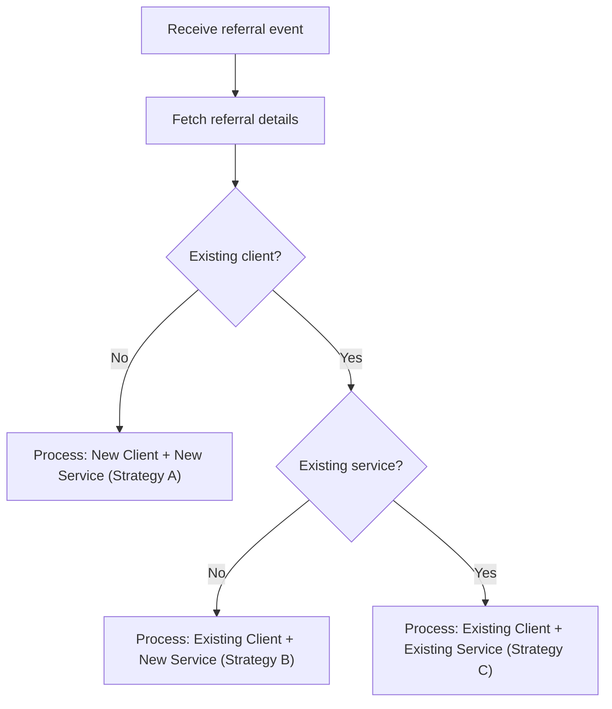
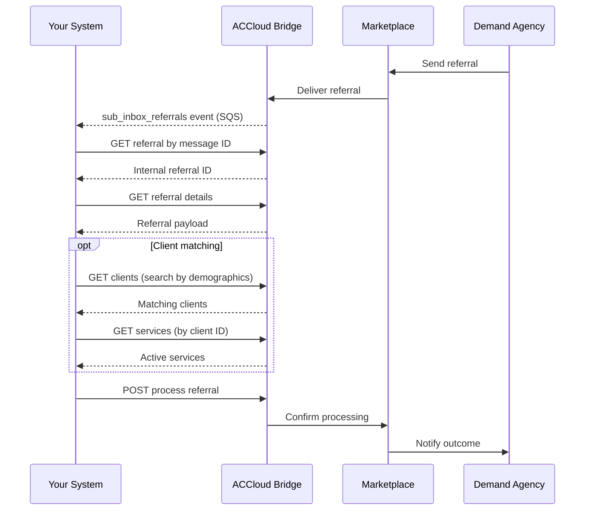

# Referrals

Referrals are sent by demand agencies through Marketplace to authorize your organization to provide services for a client. When a referral arrives, your integration should fetch the details, optionally match to existing clients and services, and then process the referral.

## Prerequisites

- [Environment setup](../setup.md) complete
- `sub_inbox_referrals` event subscription active
- Review [Error Handling](../error-handling.md) for status codes and retry guidance

---

## Step 1: Receive the Referral Event

When a demand agency sends a referral, your SQS queue receives a `sub_inbox_referrals` event payload containing the referral identifier.

- **AsyncAPI reference:** [sub_inbox_referrals](https://alayacare.github.io/alayamarket-external-docs/docs/offers/asyncapi.external.offers/#operation-send-sub_inbox_referrals)

See the [AsyncAPI spec](https://alayacare.github.io/alayamarket-external-docs/docs/offers/asyncapi.external.offers/#operation-send-sub_inbox_referrals) for the full payload schema and examples.

---

## Step 2: Fetch the Referral

You can fetch the referral using either the Marketplace message ID or the internal referral ID.

### Option A: Resolve Internal ID from Marketplace ID

* **URL:** `GET $ACCLOUD_URL/api/v2/intake/referrals/by_message_id/{alayamarket_id}/id`

* **Response:** Returns the internal AlayaCare integer referral ID.

```json
{
  "id": 789
}
```

* **Notes:**
  * `{alayamarket_id}` is the Marketplace referral/message ID from the event payload

### Option B: Fetch Referral Details by Internal ID

* **URL:** `GET $ACCLOUD_URL/api/v2/intake/referrals/alayamarket/{referral_id}`

* **Response:** Returns the full referral object including client demographics, service details, and authorization information. <!-- TODO: link to api.intake OpenAPI spec once published -->

---

## Step 3: Check for Existing Client

Before processing the referral, check whether the client already exists in your system to avoid creating duplicates.

* **API reference:** [client-api-external — Clients](https://app.swaggerhub.com/apis/AlayaCare/client-api-external#/Clients)

* **URL:** `GET $ACCLOUD_URL/ext/api/v2/patients/clients?page=1&count=100&filter={matching_parameter}`

* **Example:** Search by name and phone:

```
GET $ACCLOUD_URL/ext/api/v2/patients/clients?page=1&count=100&filter=first_name:Frank&filter=last_name:Smith
```

* **Notes:**
  * Use expected datapoints from the referral (first name, last name, phone number, date of birth) as filter parameters
  * If a match is found, note the `client_id` from the response
  * Confidence level for matching should be high to avoid merging patient files incorrectly

### Optional: Verify Client Details

If you find a potential match, you can fetch the full client record for additional verification:

* **API reference:** [client-api-external — Clients](https://app.swaggerhub.com/apis/AlayaCare/client-api-external#/Clients)

* **URL:** `GET $ACCLOUD_URL/ext/api/v2/patients/clients/{alayacare_client_id}?exclude_user_deactivated_groups=false`

---

## Step 4: Check for Existing Service

If an existing client was found, check whether they already have an active service that matches.

* **API reference:** [services-api-external — Services](https://app.swaggerhub.com/apis/AlayaCare/services-api-external#/Services)

* **URL:** `GET $ACCLOUD_URL/ext/api/v2/scheduler/services?alayacare_client_id={alayacare_client_id}&status=active&page=1&count=100`

* **Notes:**
  * Only relevant if you found an existing client in Step 3
  * If a match is found, note the `alayacare_service_id` from the response
  * Confidence level for matching should be high to avoid merging services incorrectly

---

## Step 5: Process the Referral

Based on your client/service matching results, choose one of three processing strategies.

### Strategy A: New Client + New Service

Use when no existing client or service was found.

* **URL:** `POST $ACCLOUD_URL/api/v2/intake/referrals/alayamarket/{referral_id}/process`

* **Response:** Returns the created client and service IDs.

```json
{
  "status": "processed",
  "alayacare_client_id": 1060,
  "alayacare_service_id": 21
}
```

* **Notes:**
  * No request body required
  * AlayaCare will create both a new client record and a new service from the referral data

See [examples/payloads/referral_process_new.json](../../examples/payloads/referral_process_new.json).

### Strategy B: Existing Client + New Service

Use when you matched an existing client but no existing service.

* **URL:** `POST $ACCLOUD_URL/api/v2/intake/referrals/alayamarket/{referral_id}/process`

* **Example payload:**

```json
{
  "alayacare_client_id": 1060,
  "override_client": false,
  "override_service": false
}
```

* **Notes:**
  * `alayacare_client_id` — the internal client ID from Step 3
  * `override_client: false` — preserves existing client data (set to `true` to overwrite with referral data)
  * `override_service: false` — preserves existing service data
  * A new service will be created and linked to the existing client

See [examples/payloads/referral_process_existing_client.json](../../examples/payloads/referral_process_existing_client.json).

### Strategy C: Existing Client + Existing Service

Use when you matched both an existing client and an existing service.

* **URL:** `POST $ACCLOUD_URL/api/v2/intake/referrals/alayamarket/{referral_id}/process`

* **Example payload:**

```json
{
  "alayacare_client_id": 1060,
  "alayacare_service_id": 21,
  "override_client": false,
  "override_service": false
}
```

* **Notes:**
  * `alayacare_service_id` — the internal service ID from Step 4
  * Both `override_client` and `override_service` control whether existing records are overwritten with referral data
  * The referral will be linked to the existing client and service

See [examples/payloads/referral_process_existing_both.json](../../examples/payloads/referral_process_existing_both.json).

---

## Step 6: Handle Referral Cancellation

The demand agency may cancel a referral after sending it. Your integration should listen for this event and clean up any downstream state.

* **Event:** `ReferralDemandCancelled` via `sub_inbox_referrals`
* **When:** The demand agency cancels a referral that was previously sent to your organization.

* **Recommended handling:**
  1. Receive the `ReferralDemandCancelled` event from your SQS queue.
  2. Fetch the referral status to confirm cancellation.
  3. Cancel any downstream scheduling (pending visits) associated with this referral.
  4. Update your internal state to reflect the referral is no longer active.

> If the referral was already processed and visits are scheduled, coordinate with the demand agency before cancelling active care.

---

## Decision Flowchart



---

## Sequence



---

**Next:** [Messages](messages.md) — Send and receive messages with demand agencies
