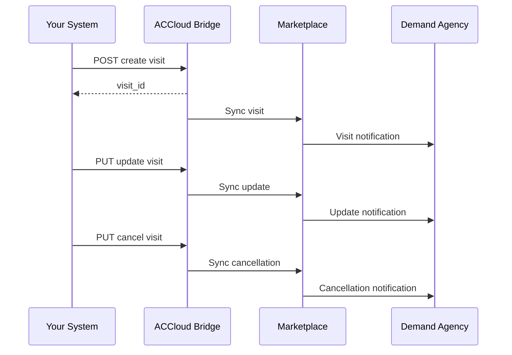

# Visits

Visit management allows your organization to report scheduled care visits back to the demand agency through AlayaCare and Marketplace. You can create, update, and cancel visits.

## Prerequisites

- [Environment setup](../setup.md) complete
- A processed referral with a known `alayacare_client_id` (from the [referral workflow](referrals.md))

---

## Step 1: Create a Visit

Schedule a new visit for a client.

* **API reference:** [scheduler-api-external — Visits](https://app.swaggerhub.com/apis/AlayaCare/scheduler-api-external/1.0.17#/Visits)

* **URL:** `POST $ACCLOUD_URL/ext/api/v2/scheduler/visits/`

* **Example payload:**

```json
{
  "start_at": "2026-04-15T09:00:00+00:00",
  "end_at": "2026-04-15T11:00:00+00:00",
  "alayacare_client_id": 1060
}
```

* **Notes:**
  * `start_at` and `end_at` must be in UTC datetime format
  * `alayacare_client_id` is the internal client ID obtained when processing the referral
  * The response returns a `visit_id` for subsequent updates
  * Visit data is synced to Marketplace and made visible to the demand agency

See [examples/payloads/create_visit.json](../../examples/payloads/create_visit.json).

---

## Step 2: Update a Visit

Modify the schedule of an existing visit.

* **URL:** `PUT $ACCLOUD_URL/ext/api/v2/scheduler/visits/{visit_id}`

* **Example payload:**

```json
{
  "start_at": "2026-04-15T10:00:00+00:00",
  "end_at": "2026-04-15T12:00:00+00:00",
  "alayacare_client_id": 1060
}
```

* **Notes:**
  * `{visit_id}` is the visit ID returned when creating the visit in Step 1
  * Only include the fields you want to update — `alayacare_client_id` is required for context

---

## Step 3: Cancel a Visit

Cancel an existing visit with a reason code.

* **URL:** `PUT $ACCLOUD_URL/ext/api/v2/scheduler/visits/{visit_id}`

* **Example payload:**

```json
{
  "start_at": "2026-04-15T10:00:00+00:00",
  "end_at": "2026-04-15T12:00:00+00:00",
  "alayacare_client_id": 1060,
  "cancelled": true,
  "cancel_code_id": 1
}
```

* **Notes:**
  * Set `cancelled: true` to mark the visit as cancelled
  * `cancel_code_id` is a cancellation reason code — obtain valid codes from your AlayaCare branch configuration
  * The demand agency will be notified of the cancellation via Marketplace

---

## Step 4: Complete a Visit

> **Status:** TBD — this endpoint is under development as part of [AM-4531](https://alayacare.atlassian.net/browse/AM-4531).

Visit completion will allow marking a visit as done with associated timekeeping data.

---

## Sequence



---

**Previous:** [Messages](messages.md) — Send and receive messages with demand agencies
